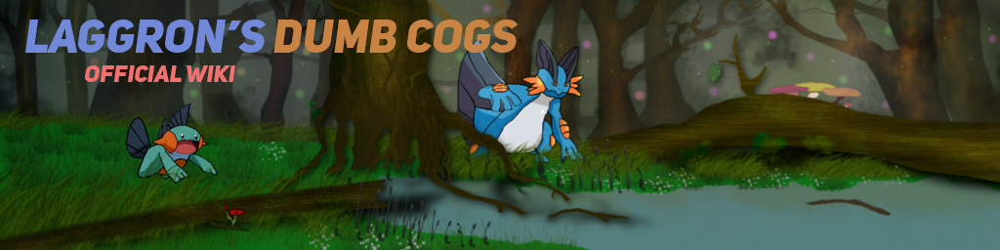

.. Laggron's Dumb Cogs documentation master file, created by
   sphinx-quickstart on Tue May 22 12:17:39 2018.
   You can adapt this file completely to your liking, but it should at least
   contain the root `toctree` directive.

Welcome to Laggron's Dumb Cogs's official documentation!
========================================================

.. HTML head data

.. title:: Laggron's Dumb Cogs documentation

.. meta::
   :name: description
   :content: Official documentation for Laggron's Dumb Cogs

.. meta::
   :property: og:title
   :content: Laggron's Dumb Cogs's documentation

.. meta::
   :property: og:description
   :content: Official documentation for Laggron's Dumb Cogs

.. Badges and artwork

.. image:: https://discordapp.com/api/guilds/363008468602454017/embed.png
    :target: https://discord.gg/AVzjfpR
    :alt: Discord server

.. image:: https://img.shields.io/badge/discord-py-blue.svg
    :target: https://github.com/Rapptz/discord.py
    :alt: discord.py

.. image:: https://github.com/retke/Laggrons-Dumb-Cogs/workflows/Tests/badge.svg
    :target: https://github.com/retke/Laggrons-Dumb-Cogs/actions
    :alt: Travis CI build

.. image:: https://readthedocs.org/projects/laggrons-dumb-cogs/badge/
    :target: http://laggrons-dumb-cogs.readthedocs.io
    :alt: Docs build

.. image:: https://img.shields.io/badge/PRs-welcome-brightgreen.svg
    :target: http://makeapullrequest.com
    :alt: PRs open

.. important:: Please make sure that you first installed
    `Red DiscordBot V3 <https://red-discordbot.readthedocs.io/en/v3-develop/>`_.
    This is needed if you want to use these cogs.

.. toctree::
   :maxdepth: 2
   :caption: Cog guides

   instantcommands
   roleinvite
   say
   tournaments
   warnsystem

.. toctree::
    :maxdepth: 2
    :caption: API Reference

    roleinvite-api
    tournaments-api
    warnsystem-api

Indices and tables
==================

* :ref:`genindex`
* :ref:`modindex`
* :ref:`search`
