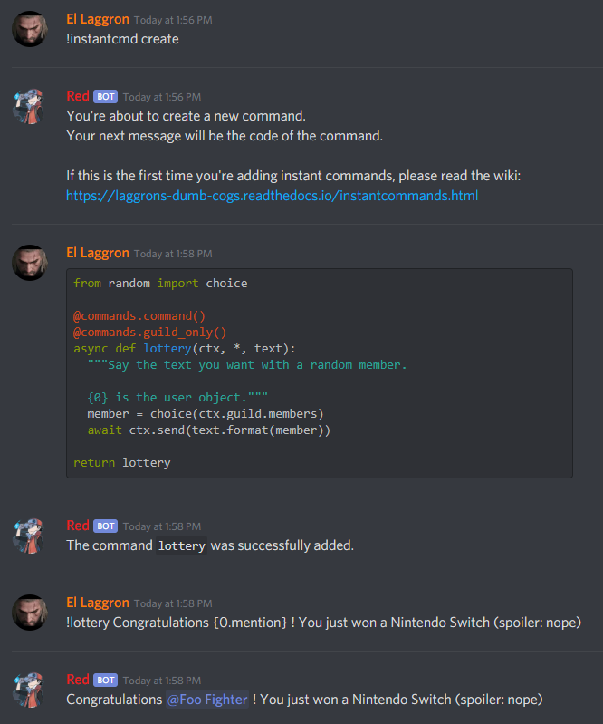

===============
InstantCommands
===============

.. note:: These docs refers to the version **1.0.0**. 
    Make sure you're under the good version by typing ``[p]cog update``.

This is the guide for the ``instantcmd`` cog. Everything you need is here.

``[p]`` is considered as your prefix.

------------
Installation
------------

To install the cog, first load the downloader cog, included
in core Red.::

    [p]load downloader

Then you will need to install the Laggron's Dumb Cogs repository::

    [p]repo add Laggrons-Dumb-Cogs https://github.com/retke/Laggrons-Dumb-Cogs v3

Finally, you can install the cog::

    [p]cog install Laggrons-Dumb-Cogs instantcmd

.. warning:: The cog is not loaded by default. 
    To load it, type this::

        [p]load instantcmd

-----
Usage
-----

InstantCommands is designed to create new commands and listeners directly 
from Discord. You just need basic Python and discord.py knowledge.

Here's an example of his it works:

Here's a list of all commands of this cog:

.. _command-instantcommand:

~~~~~~~~~~~~~~
instantcommand
~~~~~~~~~~~~~~

**Syntax**::

    [p][instacmd|instantcmd|instantcommand]

**Description**

This is the main command used for setting up the code. 
It will be used for all other commands.

.. _command-instantcommand-create:

~~~~~~~~~~~~~~~~~~~~~
instantcommand create
~~~~~~~~~~~~~~~~~~~~~

**Syntax**::

    [p]instantcommand create

**Description**

Creates a new command/listener from a code snippet.

You will be asked to give a code snippet which will contain your function. 
It can be a command (you will need to add the ``commands`` decorator) or a listener 
(your function name must correspond to an existing discord.py listener).

.. tip:: Here are some examples
    
    .. code-block:: python
    
        @roleset.command()
        @commands.command()
        async def command(ctx, *, argument):
            """Say your text with some magic"""

            await ctx.send("You excepted to see your text, "
                            "but it was I, Dio!")
        
        return command
                            
    .. code-block:: python
    
        async def on_reaction_add(reaction, user):
            await reaction.message.add_reaction('❤')
            await message.channel.send("Here's some love for " + user.mention)
        
        return on_reaction_add
            
.. note::

    Here are the available values for your code snippet:

    * ``bot`` (client object)
    
    * ``discord``
    
      * ``ext.commands``
    
    * ``asyncio``
    
    * ``inspect``
    
    * ``traceback``
    
    * ``random``
    
    * ``redbot.core``
    
      * ``checks``
      
      * ``Config``
      
      * ``utils.chat_formatting.pagify``
      
    It isn't recommanded to use the ``Config`` value for now. 
    A future release should give a ready ``Config.Config`` object.
    
.. _command-instantcommand-delete:

~~~~~~~~~~~~~~~~~~~~
instantcommad delete
~~~~~~~~~~~~~~~~~~~~

**Syntax**

.. code-block:: none

    [p]instantcommand [delete|del|remove] <name>
    
**Description**

Remove an instant command or a listener from what you registered before.
    
**Arguments**

* ``<name>`` The name of the command/listener.

.. _command-instantcommand-info:

~~~~~~~~~~~~~~~~~~~
instantcommand info
~~~~~~~~~~~~~~~~~~~

**Syntax**

.. code-block:: none

    [p]instantcommand info [command]
    
**Description**

List all existings commands and listeners created with InstantCommands.

You can give a command/listener name to show its source code.

.. note::

    This only works with InstantCommands' commands and listeners.
    
**Arguments**

* ``[commands]`` The command/listener name to get the source code from. 
  If not given, a list of existing commands and listeners created with the cog
  is shown.

--------------------------
Frequently Asked Questions
--------------------------

.. note:: 

    **Your question is not in the list or you got an unexcpected issue?**

    You should join the `Discord server <https://discord.gg/AVzjfpRM>`_ or
    `post an issue <https://github.com/retke/Laggrons-Dumb-Cogs/issues/new/choose>`_
    on the repo.

~~~~~~~~~~~~~~~~~~~~~~~~~~~~~~~~~~~~~~~~~~~~~~~~~~~~~~~~~~~~~~~~~~~~~~~~~~~~
It's written in the help message that I can add a listener. How can I do so?
~~~~~~~~~~~~~~~~~~~~~~~~~~~~~~~~~~~~~~~~~~~~~~~~~~~~~~~~~~~~~~~~~~~~~~~~~~~~

Instead of giving a :class:`~discord.ext.commands.Command` object, just
give a simple function (don't put the command decorator) and make sure
its name is matching the lowercased `Discord API listeners 
<https://discordapp.com/developers/docs/topics/gateway#commands-and-events>`_.

~~~~~~~~~~~~~~~~~~~~~~~~~~~~~~~~~~~~~~~~~~~~~~~~~~~~~~
My command was added but doesn't respond when invoked.
~~~~~~~~~~~~~~~~~~~~~~~~~~~~~~~~~~~~~~~~~~~~~~~~~~~~~~

If a command is not invoked, this is most likely due to missing arguments.
Please check that you only have the :class:`ctx <discord.ext.commands.context>`
argument and **no self argument**.

~~~~~~~~~~~~~~~~~~~~~~~~~~~~~~~
Can I use Config in my command?
~~~~~~~~~~~~~~~~~~~~~~~~~~~~~~~

Yes you can. The :class:`~redbot.core.Config` module is already imported,
you just need to use it as in a cog.

..tip:: Here's an example

    .. code-block:: python

        @commands.command(name="test")
        async def my_command(ctx):
            config = Config.get_conf(cog_instance="InstantCommands", identifier=42)
            # use anything but 260 for the identifier
            # since it's the one used for the cog settings
            config.register_guild(**{
                "foo": None
            })
        
            await config.guild(ctx.guild).foo.set("bar")
            await ctx.send("Well done")
        
        return my_command

~~~~~~~~~~~~~~~~~~~~~~~~~~~~~~~~~~~~~~~
How can limit a command for some users?
~~~~~~~~~~~~~~~~~~~~~~~~~~~~~~~~~~~~~~~

You can use the :class:`~redbot.core.checks` module, like in a normal cog.

.. tip:: Here's an example

    .. code-block:: python

        @commands.command()
        @checks.admin_or_permissions(administrator=True)
        async def command(ctx):
            # your code
        
        return command

~~~~~~~~~~~~~~~~~~~~~~~~~~~~~~~~~~~~~~~~~~
How can I import a module without problem?
~~~~~~~~~~~~~~~~~~~~~~~~~~~~~~~~~~~~~~~~~~

You can import your modules outside the function as you wish.

.. tip:: Here's an example

    .. code-block:: python

        from redbot.core import modlog
        import time

        @commands.command()
        async def command(ctx):
            # your code
        
        return command