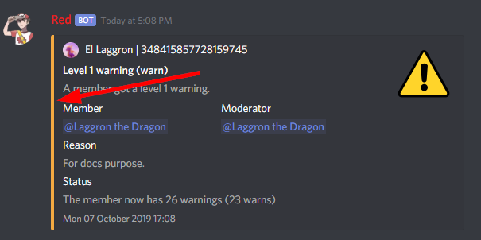
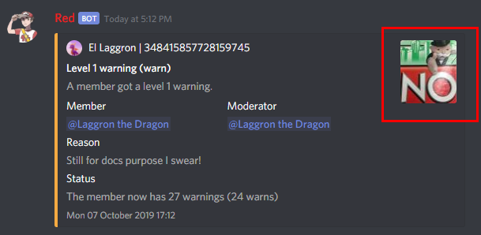

==========
WarnSystem
==========

.. note:: These docs refers to the version **1.4.0**.
    Make sure you're under the good version by typing ``[p]cog update``.

This is the guide for the ``warnsystem`` cog. Everything you need is here.

``[p]`` is considered as your prefix.

------------
Installation
------------

To install the cog, first load the downloader cog, included
in core Red.::

    [p]load downloader

Then you will need to install the Laggron's Dumb Cogs repository::

    [p]repo add Laggrons-Dumb-Cogs https://github.com/retke/Laggrons-Dumb-Cogs v3

Finally, you can install the cog::

    [p]cog install Laggrons-Dumb-Cogs warnsystem

.. warning:: The cog is not loaded by default.
    To load it, type this::

        [p]load warnsystem

-----
Usage
-----

This cog is an alternative to the Mod core cog. It provides a moderation system
similar to Dyno. Actions are stored and can be accessed at any time. This is
the rewrite of the BetterMod cog for Red V3. Here is a quick start guide.

1. Define a modlog channel

    You can define a channel where all actions will be logged, either with the
    ``[p]warnset channel`` command or with the ``[p]modlogset modlog`` command,
    from Modlog cog.

2. Set your moderators

    All members with the moderator role will be able to use the ``[p]warn``
    command. You can set the moderator and administrator role with the ``[p]set
    modrole`` and ``[p]set adminrole`` commands.

3. (Optional) Set up the mute role

    The mute from WarnSystem uses roles instead of separate channel
    permissions. Type ``[p]warnset mute`` to create the mute role. It will be
    placed below the bot's top role and all channel permissions will be edited
    so those who have this role cannot send messages and add reactions.

    You can edit this role as you want, as long as it is below the bot's top
    role so it can assign it to users.

4. Warn members

    Once this is setup, moderators and administartors will be able to use the
    ``[p]warn`` command, with 5 different levels:

    1.  Simple warning
    2.  Server mute (can be temporary)
    3.  Kick
    4.  Softban (ban then quickly unban the member, to clean his messages)
    5.  Ban (can be temporary, and also ban members not on the server)

    Each warn will send a DM to the warned member, a log in the modlog channel,
    then the bot will take actions. You can check, edit and delete a member's
    warnings with the ``[p]warnings`` command.

You now have the basic setup ready! If you want, you can setup more features
for your bot:

*   **Substitutions:** If you own a huge server, you might repeat yourself in
    the reasons of your warnings. You can setup substitutions, so you can
    include small words that will be replaced by a defined sentence. For
    example, if you set "Advertising for a Discord server." as a substitution
    of ``ad``, type this: ``[p]warn 3 @El Laggron#0260 [ad] This is your last
    warning!`` and the reason of the warn will be "Advertising for a Discord
    Server. This is your last warning!". Get started with the ``[p]warnset
    substitutions`` group command.

*   **Role removal:** Discord permissions can be a pain in the ass, and mute
    with role can be a problem. The most common situation is where a member
    has a role that grants him write access in a channel and the mute role
    cannot overwrite that. This is why this option exists, enable it with
    ``[p]warnset removeroles`` and all roles will be removed and reassigned
    once the mute ends or if the warning is deleted.

*   **Auto channel update:** When you create the mute role, all existing text
    channels are configured to make it efficient. If you enable this setting
    with ``[p]warnset autoupdate``, when you create a new text channel, it
    will automatically be updated for the mute role.

*   **Reinvite:** Enabling this feature will try to send a DM to all unbanned
    members after their temporary ban, including an invite for yout server.
    Note that the bot must share a server in commom with the unbanned member.

*   **Hierarchy:** To make sure your moderators doesn't abuse with their
    permissions, you can enable hierarchy protection. This means that the bot
    will block a moderator trying to warn a member higher than him in the role
    hierarchy, like with the manual Discord actions.

*   **Multiple modlogs:** If you want to send all warnings, mutes, kicks and
    softban in a private channel, but you want to make the ban publics, you
    can set a different channel for a specific warning level. Type ``[p]warnset
    channel #your-channel 5`` to make all bans goes into that channel. Just
    change the number for the warn level.

*   **Hide responsible moderator:** Sometimes, moderators wants to keep their
    action anonymous to the warned member. If you want to stay transparent,
    type ``[p]warnset showmod`` to show the author of a warn to the warned
    member in DM.

*   **Set number of days of messages to delete:** A Discord ban allows to set
    a specific number of days of messages sent by the banned member to delete,
    up to 7 days. By default, softbans will delete 7 days of messages and bans
    won't delete any. You can customize this with the ``[p]warnset bandays``
    command.

*   **Custom embed description:** If you want to customize your modlog and set
    your own sentence for logs sent to the modlog channel and to the warned
    member, you can do this with the ``[p]warnset description`` command.

*   **Custom embed thumbnail:** Don't like the default images in the top right
    hand corner of the embed? You can set your own image for each warn level
    with ``[p]warnset thumbnail``, common to both modlog and DM.

*   **Custom embed color:** Too much customization with embeds. Customize the
    color of the left vertical bar in the embed for each warn level. Common to
    both modlog and DM too. Use the ``[p]warnset color`` command.

*   **Convert your old BetterMod logs:** If you're migrating to V3 and you were
    using the BetterMod cog on your V2 bot, you can migrate the logs for V3!
    Get the file of your modlog history (located at
    ``/data/bettermod/history/<your server ID>.json``) and use the ``[p]warnset
    convert`` command.

*   **Masswarn:** Ready to ban your entire server? The masswarn allows you to
    warn multiple members at once. It searches through the whole member list
    based on one or more conditions, then perform an action. For example, you
    can select everyone with x role, without y permission, and who joined after
    the given date. Look at the docs for that command to know more about it,
    it can be hard to use it at first.

--------
Commands
--------

Here is a list of all commands from this cog.

^^^^
warn
^^^^

**Syntax**

.. code-block:: none

    [p]warn

**Description**

The base command used to warn members. You must either have the moderator role,
administrator role, have the administrator permission or be the server owner.

.. warning:: You **must** setup a modlog channel before using warn, either with
    the core Modlog cog (``[p]modlogset modlog``) or with WarnSystem
    (``[p]warnset channel``).

Each warning will be logged to the modlog channel, and a DM will be sent to the
warned member. If the bot cannot send a message to that member (the member may
have blocked the bot, disabled DMs from this server, or doesn't share a server
in common with the bot), it will be showed in the modlog.

You can check the warnings set on a specific member later with the
``[p]warnings`` command. This command also allows to edit the reason of the
warning, or delete them.

.. tip:: The warn level defaults to 1 if you omit it.

""""""
warn 1
""""""

**Syntax**

.. code-block:: none

    [p]warn <1|simple> <member> [reason]

**Description**

Sets a simple warning on a member. This does not take any action, but the warn
will be showed to the member and stored.

**Example**

*   .. code-block:: none

        [p]warn 1 @El Laggron#0260 Rude behaviour.

    This warns El Laggron for the following reason: Rude behaviour.

**Arguments**

*   ``<member>``: The member to warn. Can either be a mention, the name + tag,
    the name, the nickname or an ID.

*   ``[reason]``: The reason of the warn. Omitting this will set the reason as
    "No reason set.".

""""""
warn 2
""""""

**Syntax**

.. code-block:: none

    [p]warn <2|mute> <member> [duration] [reason]

**Description**

Mutes the member with a role on the server.

.. warning:: You **must** have the mute role setup. Use the ``[p]warnset mute``
    command to create/assign the role.

The member will get the mute role for the specified time. You can edit this
role as you like to allow him some channels for example. Removing his role
manually will cancel his mute without problem, but the warn will still exist.
Removing the warn with the ``[p]warnings`` command will also remove the role
if needed.

You can set a duration to the mute with the first word of the reason, which
should be a number followed by the unit. Examples:

*   ``20s`` = ``20secs`` = ``20seconds``: 20 seconds
*   ``5m`` = ``5minutes`` = ``5min``: 5 minutes
*   ``2h`` = ``2hours`` = ``2hrs``: 2 hours
*   ``1d`` = ``1day``: one day
*   ``7d`` = ``7days``: a week

You can also stack them like this:

*   ``5m30s``: 5 minutes and 30 seconds
*   ``1d12h``: One day and a half
*   ``1h45m``: 1 hours and 45 minutes

**Examples**

*   .. code-block:: none

        [p]warn 2 @El Laggron#0260 Hacked account.

    This will mute El Laggron for an undefined duration.

*   .. code-block:: none

        [p]warn 2 @El Laggron#0260 2h Spam for exp.

    This will mute El Laggron for two hours, then remove his role.

**Arguments**

*   ``<member>``: The member to warn. Can either be a mention, the name + tag,
    the name, the nickname or an ID.

*   ``[reason]``: The reason of the warn. Omitting this will set the reason as
    "No reason set.".

""""""
warn 3
""""""

**Syntax**

.. code-block:: none

    [p]warn <3|kick> <member> [reason]

**Description**

Kicks the member from the server.

**Example**

*   .. code-block:: none

        [p]warn 3 @El Laggron#0260 Selfbot.

    This will just kick the member.

**Arguments**

*   ``<member>``: The member to warn. Can either be a mention, the name + tag,
    the name, the nickname or an ID.

*   ``[reason]``: The reason of the warn. Omitting this will set the reason as
    "No reason set.".

""""""
warn 4
""""""

**Syntax**

.. code-block:: none

    [p]warn <4|softban> <member> [reason]

**Description**

Bans the member from the server, then unbans him, to mass delete his messages.
This can be considered as a kick with a massive cleanup of messages.

The bot will delete 7 days of messages by default, this can be changed with the
``[p]warnset bandays`` command.

**Example**

*   .. code-block:: none

        [p]warn 4 @El Laggron#0260 NSFW in inappropriate channels.
    
    This will kick El Laggron and delete all of his messages sent in the last 7
    days.

**Arguments**

*   ``<member>``: The member to warn. Can either be a mention, the name + tag,
    the name, the nickname or an ID.

*   ``[reason]``: The reason of the warn. Omitting this will set the reason as
    "No reason set.".

""""""
warn 5
""""""

**Syntax**

.. code-block:: none

    [p]warn <5|ban> <member> [duration] [reason]

**Description**

Bans the member from the server, can be a temporary ban. It can also be a
hackban (banning a member which is not on the server).

If you want to perform a hackban, get the ID of the user and provide it for
the ``<member>`` argument. You can get a user ID by enabling the developer mode
(User Settings > Appearance > Developer mode), then right-clicking on that user
and clicking on "Copy ID".

The bot won't delete any message by default, this can be changed with the
``[p]warnset bandays`` command.

You can set a duration to the mute with the first word of the reason, which
should be a number followed by the unit. Examples:

*   ``20s`` = ``20secs`` = ``20seconds``: 20 seconds
*   ``5m`` = ``5minutes`` = ``5min``: 5 minutes
*   ``2h`` = ``2hours`` = ``2hrs``: 2 hours
*   ``1d`` = ``1day``: one day
*   ``7d`` = ``7days``: a week

You can also stack them like this:

*   ``5m30s``: 5 minutes and 30 seconds
*   ``1d12h``: One day and a half
*   ``1h45m``: 1 hours and 45 minutes

.. attention:: Deleting the warning through the ``[p]warnings`` command does
    not remove the ban.

**Examples**

*   .. code-block:: none

        [p]warn 5 @El Laggron#0260 Harassing

    Bans El Laggron forever from the server.

*   .. code-block:: none

        [p]warn 5 @El Laggron#0260 7d Doesn't respect the previous warnings

    Bans El Laggron for a week from the server, then unbans him.

*   .. code-block:: none

        [p]warn 5 348415857728159745 Advertising for a weird dating website,
        then leaves.

    Bans El Laggron forever while he is not on the server.

**Arguments**

*   ``<member>``: The member to warn. Can either be a mention, the name + tag,
    the name, the nickname or an ID.

*   ``[reason]``: The reason of the warn. Omitting this will set the reason as
    "No reason set.".

^^^^^^^^
masswarn
^^^^^^^^

**Syntax**

.. code-block:: none

    [p]masswarn

**Description**

Warn multiple members at once. This advanced command allows you to filter
members to warn with UNIX-like arguments, called flags.

Each "flag" is one more condition for the search. For example, ``[p]masswarn
--has-role "New Member" --joined-after "16 june 2019"`` will filter the
member who have the "New Member" role **and** who joined after the 16th of
June of 2019. The search begins with all members on the server, then each
condition is checked on each member to know if it should be kept in the
masswarn or not.

You also have to tell to the bot what to do. Unlike the warn command where it
takes actions, sends a message to the member and one in the modlog, you can
decide what the bot should do, to make it faster or prevent spam.

*   ``--take-actions`` will perform the action related to the warn (add the
    mute role, kick or ban a member...)

*   ``--send-modlog`` will send a message in the modlog

*   ``--send-dm`` will send a DM to the member

.. warning:: You have to put at least one of those flags.

You can then put the optional ``--reason`` flag to set the reason of the
warning. Be sure to put it enclosed in quotes. If you're performing a level 2
or 5 warning, you can also use the ``--time`` flag to define the duration of
the mute/ban if you want to make it temporary, the format of the time is the
same as for the simple warnings.

""""""""""""

Some flags needs an input with them, it can be a date, a set of
roles, a regex expression... We will explain how input works for those
flags. Note that if you need to put multiple words, you'll have to use quotes.

**Date imput**

For the flags ``--joined-before`` and ``--joined-after``, you will need to
put a specific date. A lot of formats are supported, here are some
examples:

*   ``27 june 2018``
*   ``13/2/18``
*   ``august 2019`` (will be the first day of the month)
*   ``2017`` (will be the first day of the year)
*   ``monday`` (will be the first monday of the month)
*   ``23 jun 12:00`` (you can also specify the hour)
*   ``Wednesday, 19th of September of 2018`` (if you really want to lose
    time, that works too)

**Role input**

The flags ``--has-role``, ``--has-any-role``, ``--has-all-roles``,
``--has-none-roles``, ``--above`` and ``--below`` requires you to type one
or more roles. You can provide the role ID or the role name, in quotes if
there are spaces. Here are some examples:

*   ``--has-role Moderator``
*   ``--has-any-role Member Staff "Nitro Booster" 168091848718417920``
*   ``--has-none-roles "Reddit Moderator"``
*   ``--below Administrators``

**Permission input**

The flags ``--has-perm``, ``--has-any-perm``, ``--has-all-perms`` and
``--has-none-perms`` requires discord permissions, formatted as provided
by the API. Here are the names you have to use:

.. code-block:: yaml

    General permissions:
    - administrator
    - view_audit_log
    - manage_guild
    - manage_roles
    - manage_channels
    - kick_members
    - ban_members
    - create_instant_invite
    - change_nickname
    - manage_nicknames
    - manage_emojis
    - manage_webhooks

    Text permissions:
    - read_messages
    - read_message_history
    - send_messages
    - send_tts_messages
    - attach_files
    - embed_links
    - external_emojis
    - mention_everyone
    - manage_messages
    - add_reactions

    Voice permissions:
    - connect
    - speak
    - stream
    - use_voice_activation
    - priority_speaker
    - move_members
    - mute_members
    - deafen_members

Here are some examples:

*   ``--has-perm send_messages``
*   ``--has-any-perm manage_messages manage_channels manage_roles``
*   ``--has-none-perms administrator manage_guild``
*   ``--has-all-perms send_messages connect``

**Member input**

The flags ``--select``, ``--hackban-select`` and ``--exclude`` requires you to
pass multiple members, either with their name, their nickname, their name+tag,
their ID or by mentionning them (only IDs works for ``--hackban-select``).
Here are some examples:

*   ``--select "El Laggron#0260" 133801473317404673 Twentysix``
*   ``--exclude aikaterna#1393 "Kowlin, That silver Yuumi main"``
*   ``--hackban-select 301368585714925568 336966738103107584``

**Regual expressions input (regex)**

The flags ``--name``, ``--nickname`` and ``--display-name`` requires
regular expressions. Not going to explain how those work here, you can
learn how to use those on `Python's guide
<https://docs.python.org/3/library/re.html>`_ and test your expressions
with `regex101 <https://regex101.com/>`_. Just keep in mind you have to
keep your expression enclosed in quotes.

""""""""""""

Now it's time to list all of the flags.

*   **Actions**

    *   ``--take-action`` ``take-actions`` *Defines if the bot should take an
        action (add the mute role, kick/ban the member)*

    *   ``--send-dm`` *Defines if the bot should send a DM to the warned
        members*

    *   ``--send-modlog`` *Defines if the bot should send a message in the
        modlog channel*

    *   ``confirm`` *If passed, the bot won't ask for a confirmation and just
        directly process the masswarn silently. This can be useful combined
        with a scheduler.*
    
    *   ``--reason <text>`` *The reason of the masswarn, substitutions works*
    *   ``--time`` ``--length`` *The duration of the warn, for mutes and bans*

*   **Member search**

    *   ``--select [member, ...]`` *Select multiple members to include in the
        masswarn, they are not affected by your search*
    
    *   ``--hackban-select [member, ...]`` *Select multiple users outside of
        the server for a hackban. You have to provide valid user IDs and the
        warning level must be 5.*
    
    *   ``--exclude [member, ...]`` *Select multiple members to exclude from
        the search, they won't be warned*

    *   ``--everyone`` *Includes everyone in the server, your search will
        therefore not be committed, the* ``--exclude`` *flag will also not be
        used*

    *   ``--name <regex>`` *Only includes the members which names validates to
        the given expression*

    *   ``--nickname <regex>`` *Only includes the members which nicknames
        validates to the given expression, this excludes members without
        nicknames*

    *   ``--display-name <regex>`` *Only includes the members which nicknames,
        or name if nickname isn't set, validates to the given expression*

    *   ``--only-humans`` *Excludes all bots from the search*
    *   ``--only-bots`` *Only includes bots in the search*

    *   ``--joined-before <date>`` *Members who joined after the given date
        will be excluded from the masswarn*

    *   ``--joined-after <date>`` *Members who joined before the given date
        will be excluded from the masswarn*

    *   ``--last-njoins <number>`` *Includes the last x members of the server,
        this is useful in case of a raid*

    *   ``--first-njoins <number>`` *Includes the first x members of the
        server, if you want to purge the elders you monster*

*   **Permissions search**

    *   ``--has-perm <permission>`` *Includes the members with the given
        permission, this is based on roles, not channel permissions*

    *   ``--has-any-perm [permission, ...]`` *Includes the members who have any
        of the given permissions*

    *   ``--has-all-perms [permission, ...]`` *Includes the members who have
        all of the given permissions*

    *   ``--has-none-perms [permission, ...]`` *Include the members who have
        none of the given permissions*

    *   ``--has-perm-int <number>`` *Includes the members whose permission
        integer matches what you gave, you can calculate your permission
        integer on the* `permissions calculator
        <https://discordapi.com/permissions.html>`_

*   **Role search**

    *   ``--has-role <role>`` *Includes the members who have the given role*

    *   ``--has-any-role [role, ...]`` *Includes the members who have any of
        the given roles*

    *   ``--has-all-roles [role, ...]`` *Includes the members who have all of
        the given roles*

    *   ``--has-none-roles [role, ...]`` *Include the members who have none of
        the given roles*

    *   ``--has-no-role`` *Excludes the members with any custom role*

    *   ``--has-exactly-nroles <number>`` *Includes the members who have the
        number of roles given, this doesn't count the @everyone role*

    *   ``--has-more-than-nroles`` *Includes the members who have more roles
        than the number given, this doesn't count the @everyone role*

    *   ``--has-less-than-nroles`` *Includes the members who have less roles
        than the number given, this doesn't count the @everyone role*

    *   ``--above <role>`` *Includes the members whose top role is above the
        given role*

    *   ``--below <role>`` *Includes the members whose top role is below the
        given role*

""""""""""""

Enough info, time for explained examples.

*   ``[p]masswarn 2 --take-actions --send-dm --send-modlog --reason "Potential
    raid" --time 24h --joined-after "12 august 14:30" --has-no-roles
    --only-humans`` This will mute for a day all members who joined after the
    12th of august at 2:30 p.m. without roles and excluding bots. Everyone will
    receive a message and this will be logged in the modlog.

*   ``[p]masswarn 5 --take-actions --send-dm --reason "toxic potatoes"
    --has-role Starbucks`` Just bans everyone with the role "Starbucks"

^^^^^^^^
wsunmute
^^^^^^^^

**Syntax**

.. code-block:: none

    [p]wsunmute <member>

**Description**

Unmutes a member muted with WarnSystem.

This will remove the mute role, grant
his roles back if they were removed by the mute (see ``[p]warnset
removeroles``) and, if the mute was temporary, cancel the timer to prevent
unwanted roles operations.

This operation is not logged and doesn't take any reason.

.. note:: wsunmute = WarnSystem unmute. Allows the core mod cog to be loaded,
    feel free to add an alias.

**Arguments**

*   ``<member>``: The member you're trying to unmute.

^^^^^^^
wsunban
^^^^^^^

**Syntax**

.. code-block:: none

    [p]wsunban <member>

**Description**

Unbans a member from the server.

This will cancel any timer if this was a
temporary ban to prevent unwanted unbans.

This operation is not logged and doesn't take any reason.

.. note:: wsunban = WarnSystem unban. Allows the core mod cog to be loaded,
    feel free to add an alias.

**Arguments**

*   ``<member>``: The member you're trying to unmute.

^^^^^^^
automod
^^^^^^^

**Syntax**

.. code-block:: none

    [p]automod

**Description**

WarnSystem's automod configuration. See subcommands.

.. note:: This respects Red's automod immune system. If you want to immune
    a role or a member from all of WarnSystem's automated actions, use
    ``[p]autoimmune`` (from Core cog).

""""""""""""""
automod enable
""""""""""""""

**Syntax**

.. code-block:: none

    [p]automod enable [confirm]

**Description**

Enable or disable WarnSystem's automod. This is disabled by default.

.. attention:: Disabling this will disable all automod systems, even if they're
    enabled.

**Arguments**

*   ``[enable]``: The new status to set. If omitted, the bot will display the
    current setting and show how to reverse it.

""""""""""""
automod warn
""""""""""""

**Syntax**

.. code-block:: none

    [p]automod warn
    [p]automod warn add
    [p]automod warn delete <index>
    [p]automod warn list
    [p]automod warn show <index>

**Description**

Configures the automod based on member's modlog. This allows automatic actions
based on previous given warnings.

For example, you can make it so if someone receives 3 level 1 warnings within a
week, he will automatically get a level 3 (kick) warning with the reason you
defined. A lot of options are possible.

Use ``[p]automod warn add`` to add a new rule. This will open an interactive
menu that asks for the following informations:

*   The limit of warns (how many warnings should trigger the automod?)
*   The level of the warning that will be given once the rule is triggered.
*   The reason of the warning
*   The optional time limit (if member gets x warnings **within duration**)

*   If warn level is 2 or 5, the optional duration of the warning
    (temp mute or ban)

*   The level of the warning the bot should count (for example, only count
    level 1 warnings). Omit to count all possible warnings.

*   If the bot should only count warnings given by the automod. If this is
    enabled, warnings given by moderators will not be counted.

Your rule will be saved in a list. View this list with ``[p]automod warn list``
to get its index. With the index, you can view the info with ``[p]automod warn
show`` or delete it with ``[p]automod warn delete``.

"""""""""""""
automod regex
"""""""""""""

**Syntax**

.. code-block:: none

    [p]automod regex
    [p]automod regex add <name> <regex> <level> [time] <reason>
    [p]automod regex delete <name>
    [p]automod regex list
    [p]automod regex show <name>

**Description**

Create and manage automod rules that will warn people if they send a message
that matches your Regex expression. This can be used for example to warn people
automatically if they send a Discord invite, or any link.

.. note:: Regex, short for regular expression, is a way to make advanced rules
    for checking if a phrase matches what you need, with multiple possible
    conditions.

    You can use `regex101 <https://regex101.com/>`_ to test your expressions
    and have detailed explainations. Make sure to use Python mode.

    If you don't know about Regex, I recommand you to check `Trusty's short
    introduction to Regex for ReTrigger cog
    <https://github.com/TrustyJAID/Trusty-cogs/tree/master/retrigger#how-to-use-retrigger>`_.
    For a complete guide, check `Python's documentation for Regex
    <https://docs.python.org/3/library/re.html#regular-expression-syntax>`_
    and keep in mind `regex101 <https://regex101.com/>`_ is great for testing.

Use ``[p]automod regex add`` to create a new rule with the following arguments:

*   ``<name>``: The name of your rule.

*   ``<regex>``: Your regular expression. Enclose in quotes if there are spaces
    inside.

*   ``<level>``: The level of the warning the bot should take.

*   ``[time]``: If level is 2 or 5, optional duration for your mute or ban.

*   ``<reason>``: The reason of the warning. You can use the following keywords
    inside your reason:

    *   ``{member}``: the warned member in the format "name#0000". Other
        formats are possible:

        *   ``{member.mention}``
        *   ``{member.name}``
        *   ``{member.id}``

    *   ``{channel}``: the channel where the message was send in the format
        "channel-name". Other possible formats:

        *   ``{channel.mention}``
        *   ``{channel.category}``
        *   ``{channel.id}``

    *   ``{guild}``: the current server, if needed, in the format "server
        name". Other possible formats:

        *   ``{guild.id}``

    Click for the list of all possible formats for :class:`~discord.Member`,
    :class:`~discord.Channel` and :class:`discord.Guild`.

Example: ``[p]automod regex add discord_invite
"(?i)(discord\.gg|discordapp\.com\/invite|discord\.me)\/(\S+)"
1 Discord invite sent in {channel.mention}.``

You can then view the informations of that rule with ``[p]automod regex show``,
delete it with ``[p]automod regex delete`` and list other rules with
``[p]automod regex list``.

""""""""""""""""
automod antispam
""""""""""""""""

**Syntax**

.. code-block:: none

    [p]automod antispam
    [p]automod antispam delay <delay>
    [p]automod antispam enable [enable]
    [p]automod antispam info
    [p]automod antispam threshold <max_messages> <delay>
    [p]automod antispam warn <level> [duration] <reason>

**Description**

Antispam system management. This will warn members if they send messages too
quickly.

Use ``[p]automod antispam enable`` to enable the antispam system. You can
enable and disable it without affecting other automod functions. **You still
need to have automod enabled.**

You will then have the antispam enabled with default settings:

*   Maximum of 5 messages within 5 seconds. Modify with ``[p]automod antispam
    threshold``.

*   One reminder within a minute before warn. Modify with ``[p]automod antispam
    delay``.

*   Level 1 warn applied for the reason "Sending messages too fast.". Modify
    with ``[p]automod antispam warn``.

You can check these info with ``[p]automod antispam info``.

A bit more details for the "reminder": if the antispam is triggered, the bot
will send a text warning directly in the channel, mentionning the member
to warn him. If the antispam is triggered a second time within a minute, then
the bot will take actions, as set with ``[p]automod antispam warn``.

This is a way to make people aware of the antispam, most of the members will
quickly correct their behaviour and avoid a spam of warnings. Of course you can
increase or decrease this period with ``[p]automod antispam delay`` (in
seconds). You can completly disable this and immediatly take actions by
settings a delay of 0.

^^^^^^^
warnset
^^^^^^^

**Syntax**

.. code-block:: none

    [p]warnset

**Description**

Base command used for all WarnSystem settings.

""""""""""""""""
warnset settings
""""""""""""""""

**Syntax**

.. code-block:: none

    [p]warnset settings

**Description**

Lists all settings defined on the current server.

""""""""""""""""""
warnset autoupdate
""""""""""""""""""

**Syntax**

.. code-block:: none

    [p]warnset autoupdate [enable]

**Description**

Enables or disables the automatic update of new channels for the mute role. If
you enable this, every time a new text channel is created, the bot will update
its permissions to deny to the mute role the ability to send messages and add
reactions.

This is disabled by default.

**Arguments**

*   ``[enable]``: The new status to set. If omitted, the bot will display the
    current setting and show how to reverse it.

"""""""""""""""
warnset bandays
"""""""""""""""

**Syntax**

.. code-block:: none

    [p]warnset bandays <ban_type> <days>

**Descritpion**

Defines how many days of messages should be deleted when a member is banned or
softbanned. The number of days can be between 1 and 7. You can set 0 to disable
message deletion for the bans, not for softbans.

**Arguments**

*   ``<ban_type>``: The type of ban that should be edited. Either ``ban`` or
    ``softban``.

*   ``<days>``: The number of days of messages that should be deleted. Between
    1 and 7 only. 0 to disable for bans.

"""""""""""""""
warnset channel
"""""""""""""""

**Syntax**

.. code-block:: none

    [p]warnset channel <channel> [level]

**Description**

Defines the modlog channel for the cog. This is a required step before warning
members.

.. note:: You can also use the core Red modlog by loading the modlogs cog, then
    using the ``[p]modlogset modlog`` command.

If you want to set a different modlog for a specific warning level (like,
sending ban warnings in a different channel), you can provide the warning level
after your channel to set it as the modlog channel for this specific warning
level.

**Arguments**

*   ``<channel>``: The text channel where the modlog will be set.

*   ``[level]``: The warning level associated to the channel. If this is not
    provided, the channel will be set as the default modlog channel.

"""""""""""""
warnset color
"""""""""""""

**Syntax**

.. code-block:: none

    [p]warnset color <level> <color>

**Description**

This will edit the color of the embeds' left bar for each warning level. The
color is the same for the modlog and the member.

**Arguments**

*   ``<level>``: The level of the warning you want to edit, this must be a
    number between 1 and 5.

*   ``<color>``: The new color you want to set. It can be an hexadecimal value
    (#FFFFFF = white) or the english name of a color, such as ``dark-blue``,
    ``red`` or even ``blurple``. `Full list
    <https://discordpy.readthedocs.io/en/latest/api.html#discord.Colour>`_

"""""""""""""""
warnset convert
"""""""""""""""

**Syntax**

.. code-block:: none

    [p]warnset convert <path>

**Description**

Converts a V2 BetterMod history file to migrate its logs to WarnSystem V3.

The history file is located at the following path:
``Red-DiscordBot/data/bettermod/history/<server ID>.json``. You can grab your
server ID with the ``[p]serverinfo`` command.

You can decide to append or overwrite the logs to the current logs through
the guided configuration. Append will get the logs and add them, while
overwrite will reset the current logs and replace them with the migrated ones.

**Example**

*   .. code-block:: none

        [p]warnset convert /home/laggron/Desktop/Red-DiscordBot/data/bettermod/history/363008468602454017.json

**Arguments**

*   ``<path>``: The path to your history file.

"""""""""""""""""""
warnset description
"""""""""""""""""""

**Syntax**

.. code-block:: none

    [p]warnset description <level> <destination> <description>

**Description**

Edits the description of an embed for the modlog or the warned member. The
default description for the modlog is "A member got a level (x) warning.", for
the member, it is "The moderation team set you a level (x) warning.".

You can use the following keys in your custom description:

*   ``{invite}``: Generates an invite for the server and place it.

*   ``{member}``: The warned member. You can use attributes such as
    ``{member.name}``, ``{member.id}``, ``{member.nick}``...

*   ``{mod}``: The responsible mod of a warn. You can use the same attributes
    as for ``{member}``.

*   ``{duration}``: The duration of a mute/ban if set.

*   ``{time}``: The current date and time.

**Arguments**

*   ``<level>``: The level of the warn to edit.

*   ``<destination>``: Either ``user`` for the warned member or ``modlog`` for
    the modlog.

*   ``<description>``: The new description.

""""""""""""""""""""
warnset detectmanual
""""""""""""""""""""

**Syntax**

.. code-block:: none

    [p]warnset detectmanual [enable]

**Description**

Defines if you want the bot to automatically log manual bans taken on the
server. This will send a message in the modlog and create a case assigned to
the banned member with the reason set via Discord. However, the bot will not be
able to send a DM.

This is disabled by default.

**Arguments**

*   ``[enable]``: The new status to set. If omitted, the bot will display the
    current setting and show how to reverse it.

"""""""""""""""""
warnset hierarchy
"""""""""""""""""

**Syntax**

.. code-block:: none

    [p]warnset hierarchy [enable]

**Description**

Enables or disables the hierarchy respect. If you enable this, the bot will
make sure the moderator is allowed to warn someone with the Discord hierarchy
rules (cannot warn someone if the warned member has a role equal or higher than
the moderator's top role).

This is disabled by default.

**Arguments**

*   ``[enable]``: The new status to set. If omitted, the bot will display the
    current setting and show how to reverse it.

""""""""""""
warnset mute
""""""""""""

**Syntax**

.. code-block:: none

    [p]warnset mute [role]

**Description**

Creates a role used for muting the members, or set an existing one as the mute
role. If you don't provide any role, the bot will create one below his top
role, then deny the "Send messages" and "Add reactions" on all text channels.
**Editing all channels takes a long time, depending on the number of text
channels you have on the server,** so don't worry if nothing happens for about
30 seconds, it's doing the setup for the mute.

You can also provide an existing role to set it as the new mute role.
**Permissions won't be modified in any channel in that case**, so make sure you
have the right permissions setup for that role.

.. tip:: You can use ``[p]warnset autoupdate`` to automatically update new
    channels created on your server, to make sure the mute role stays efficient
    everywhere.

.. tip:: The ``[p]warnset refreshmuterole`` will iterate all channels and make
    sure the channels have the correct permissions set for the mute role ("send
    messages", "add reactions" and "speak" permissions denied).

**Arguments**

*   ``[role]``: The exact name of an existing role to set it as the mute role.
    If this is omitted, a new role will be created.

"""""""""""""""""""""""
warnset refreshmuterole
"""""""""""""""""""""""

**Syntax**

.. code-block:: none

    [p]warnset refreshmuterole

**Description**

Check if the mute role's permissions match your server channels. If permissions
are wrong somewhere, they will be adjusted. The bot checks for the following
permissions:

*   Send messages denied
*   Add reactions denied
*   Speak denied

This checks text and voice channels, and categories too. Once the bot finished,
the number of updated channels will be shown.

This is useful if you lost track of the permissions, or didn't enable the
autoupdate function (see ``[p]warnset autoupdate``).

""""""""""""""""
warnset reinvite
""""""""""""""""

**Syntax**

.. code-block:: none

    [p]warnset reinvite [enable]

**Description**

Enables or disables the DM sent to unbanned members. If you enable this, make
sure the bot has the permission to create new invites.

This is enabled by default.

**Arguments**

*   ``[enable]``: The new status to set. If omitted, the bot will display the
    current setting and show how to reverse it.

"""""""""""""""""""
warnset removeroles
"""""""""""""""""""

**Syntax**

.. code-block:: none

    [p]warnset removeroles [enable]

**Description**

Defines if the bot should remove all roles from a member when he gets muted
(warn 2). This can be useful because, in some cases, some channels can still
be accessible to a muted member (for example, when he has a role that grants
him access in a private channel).

This behaviour is due to Discord's permissions system ; the mute role is denied
from sending messages and adding reactions in all text channels, but if another
role forces the permission (green tick), it will overwrite the mute's
permissions, **even if the role is higher in the hierarchy**.

.. attention:: This method exists to prevent roles from overwriting the mute
    role's restrictions, **this doesn't apply on member permissions**. If a
    member has a forced permission set in the channel, it will overwrite the
    mute and the bot won't try to fix it.

If the mute ends (timed mute) or if you delete the warning, the roles of the
member will be added back. Make sure to set a timed mute if you want the bot
to add roles back without removing the warning, since removing the mute role
manually will not grant the roles back.

.. tip:: To have good permissions on your server, prevent as much as possible
    forcing a permission in a channel (green tick) and leave it on grey, try to
    use role permissions instead.

This setting is enabled by default.

**Arguments**

*   ``[enable]``: The new status to set. If omitted, the bot will display the
    current setting and show how to reverse it.

"""""""""""""""
warnset showmod
"""""""""""""""

**Syntax**

.. code-block:: none

    [p]warnset showmod [enable]

**Description**

Toggles if the bot should show or hide the responsible moderator of a warn to
the warned member in DM.

This is disabled by default.

**Arguments**

*   ``[enable]``: The new status to set. If omitted, the bot will display the
    current setting and show how to reverse it.

"""""""""""""""""""""
warnset substitutions
"""""""""""""""""""""

**Syntax**

.. code-block:: none

    [p]warnset substitutions add <name> <text>
    [p]warnset substitutions [delete|del] <name>
    [p]warnset substitutions list

**Description**

Group command for managing the substitutions. A substitution is used to replace
a small word in brackets by a long sentence in your warn reason, to avoid
repetitions when taking actions.

Use ``[p]warnset substitutions add <name> <text>`` to create a substitution,
where ``<name>`` is the keyword and ``<text>`` is what will replace the
keyword.

Use ``[p]warnset delete`` to delete a substitution and ``[p]warnset list`` to
list them.

**Example**

| ``[p]warnset substitutions add lastwarn This is your last warning!``
| This creates a substitution with the keyword ``lastwarn``.

| ``[p]warn 3 @El Laggron#0260 Racist insults. [lastwarn]``
| The reason of this warn will be: Racist insults. This is your last warning!

"""""""""""""""""
warnset thumbnail
"""""""""""""""""

**Syntax**

.. code-block:: none

    [p]warnset thumbnail <level> [url]

**Description**

Edits the small image located at the top right hand corner on the embeds sent
in the modlog and to the members.

You can also completly remove those images by omitting the URL argument.

If you want to restore the default images, here are the original URLs:

*   `warn 1 <https://i.imgur.com/Bl62rGd.png>`_
*   `warn 2 <https://i.imgur.com/cVtzp1M.png>`_
*   `warn 3 <https://i.imgur.com/uhrYzyt.png>`_
*   `warn 4 <https://i.imgur.com/uhrYzyt.png>`_
*   `warn 5 <https://i.imgur.com/DfBvmic.png>`_

**Arguments**

*   ``<level>``: The level of the warning you want to edit, this must be a
    number between 1 and 5.

*   ``[url]``: The direct URL to the image you want to use. Omit this argument
    to remove images.

^^^^^^^^^^^^^^
warnsysteminfo
^^^^^^^^^^^^^^

.. note:: This command is locked to the bot owner.

**Syntax**

.. code-block:: none

    [p]warnsysteminfo

**Description**

Shows multiple informations about WarnSystem such as its author, its version,
the link for the Github repository, the Discord server and the documentation,
and a link for my Patreon if you want to support my work ;)

--------------------
Additional resources
--------------------

^^^^^^^^^^^^^^^^^^^^^^^^^^^
Migrating to WarnSystem 1.3
^^^^^^^^^^^^^^^^^^^^^^^^^^^

The 3rd major update of WarnSystem brought important changes to the way data is
stored. This allows a gain in performance and the reduction of the file size.

Once you load WarnSystem for the first time after updating, the cog will try
to run its data conversion tool to convert your data to the new body. This can
take a while, but servers with really big config files (looking at you
Fortnite), the conversion tool might not be powerful enough to handle this
much data.

If you're reading this, then the conversion tool probably failed. If you
haven't done it yet, **contact me, El Laggron**, and tell me about your issue.
This is not always related to the size of your file, and might be a simple
bug.

.. warning:: Before reading below, make sure you contacted me first. I will
    tell you, based on the error and your data, if doing the steps below is
    required.

    If you're not experienced with databases, ask me and I will help you with
    the update.

I'm going to explain in details the changes brought with this update, so you
can try to convert the data yourself.

Find the code used for the data converter in the ``__init__.py`` file,
function is ``_convert_to_v1``.

.. caution:: For obvious reasons, backup your data!

Two things are being changed inside the database :

""""""""""""""""""""""""""""""""""""""""""""""""""""""""""""""""
Temporary warnings are stored as a dictionnary instead of a list
""""""""""""""""""""""""""""""""""""""""""""""""""""""""""""""""

This is a value set within the guild settings (accessed with ``await
warnsystem.data.guild(ctx.guild).temporary_warns()``) that stores temporary
mutes and bans. It stores the same data as the modlog history, but saving it
in its own place allow performance gains, by only iterating through the
warnings we're looking for when unmuting/unbanning.

This is how the data was stored before 1.3 :

.. code-block:: json

    {
        "temporary_warns": [
            {
                "member": 221333470830526464,
                "level": 1,
                "author": 348415857728159745,
                "reason": "Advertising",
                "time": "Thu 01 August 2019 23:41:49",
                "duration": "1 minute and 12 seconds",
                "until": "Thu 01 August 2019 23:43:01",
                "roles": []
            }
        ]
    }

As you can see, this is a list of dictionnaries, with all data required. The
change done here is that ``temporary_warns`` is a dictionnary, with the
member's ID as the key, and the data associated to it as the value. This is
what the data above should look like after the update :

.. code-block:: json

    {
        "temporary_warns": {
            "221333470830526464": {
                "level": 1,
                "author": 348415857728159745,
                "reason": "Advertising",
                "time": "Thu 01 August 2019 23:41:49",
                "duration": "1 minute and 12 seconds",
                "until": "Thu 01 August 2019 23:43:01",
                "roles": []
            }
        }
    }

Basically, the ``member`` key is deleted from the data dictionnary, and the ID
is used as the key.

""""""""""""""""""""""""""""""""""""""""""""""""""""""""""""""
Dates and durations are stored as seconds instead of sentences
""""""""""""""""""""""""""""""""""""""""""""""""""""""""""""""

Looking back at this, I took one of the worst possible decisions when coding
WarnSystem 1.0. I'm going to show you how a warning was stored before 1.3:

.. code-block:: json

    [
        {
            "level": 2,
            "author": 348415857728159745,
            "reason": "I'm testing",
            "time": "Thu 01 August 2019 23:42:25",
            "duration": "1 minute and 12 seconds",
            "until": "Thu 01 August 2019 23:43:37"
        }
    ]

The changes affects the ``time``, ``duration`` and ``until`` keys. Using a
sentence for storing dates and durations was useful because I didn't have to
touch anything when displaying the warn, just reading the dictionnary.

There was two problems with this:

*   Storing text instead of a number is way heavier

*   If I needed the time object, like for comparison, it could cost a lot of
    resources.

Also, the ``until`` key was useless and could be calculated with the two
other keys.

The most common way of storing dates and durations when programming, which I
wasn't aware of at that time, is only using seconds. For dates, computers
calculate the number of seconds since Epoch (1 january 1970). Sounds like a
big number, but it is the most efficient way of storing a date. You can compare
two dates easily (which is needed for automod), and getting the day of the
month, or the hour and minute, only consists of divisions.

WarnSystem 1.3 converts all of those dates and durations to seconds, this is
what a warning should look like after the update:

.. code-block:: json

    {
        "level": 2,
        "author": 348415857728159745,
        "reason": "I'm testing",
        "time": 1564695745,
        "duration": 72,
    }

Converting the ``time`` key is very easy:

.. code-block:: python

    >>> from datetime import datetime
    >>> time = datetime.strptime("Thu 01 August 2019 23:42:25", "%a %d %B %Y %H:%M:%S")
    >>> time.timestamp()
    1564695745.0

However, converting the ``duration`` is a horrible nightmare, you're allowed to
blame me as much as you want for this stupid choice. The duration was stored
with an english sentence like this: ``"3 hours, 15 minutes and 1 second"``. I
thought it was going to be easier, but hell no, it's really dumb. WarnSystem
*tries* to convert this insanity to a pure number of seconds with some weird
code below:

.. code-block:: python

    from datetime import timedelta

    units_name = {
        0: (_("year"), _("years")),
        1: (_("month"), _("months")),
        2: (_("week"), _("weeks")),
        3: (_("day"), _("days")),
        4: (_("hour"), _("hours")),
        5: (_("minute"), _("minutes")),
        6: (_("second"), _("seconds")),
    }  # yes this can be translated
    separator = _(" and ")
    time_pattern = re.compile(
        (
            r"(?P<time>\d+)(?: )(?P<unit>{year}|{years}|{month}|"
            r"{months}|{week}|{weeks}|{day}|{days}|{hour}|{hours}"
            r"|{minute}|{minutes}|{second}|{seconds})(?:(,)|({separator}))?"
        ).format(
            year=units_name[0][0],
            years=units_name[0][1],
            month=units_name[1][0],
            months=units_name[1][1],
            week=units_name[2][0],
            weeks=units_name[2][1],
            day=units_name[3][0],
            days=units_name[3][1],
            hour=units_name[4][0],
            hours=units_name[4][1],
            minute=units_name[5][0],
            minutes=units_name[5][1],
            second=units_name[6][0],
            seconds=units_name[6][1],
            separator=separator,
        )
    )

    def get_timedelta(text: str) -> timedelta:
        # that one is especially hard to convert
        # time is stored like this: "3 hours, 2 minutes and 30 seconds"
        # why did I even do this fuck me
        if isinstance(text, int):
            return timedelta(seconds=text)
        time = timedelta()
        results = re.findall(time_pattern, text)
        for match in results:
            amount = int(match[0])
            unit = match[1]
            if unit in units_name[0]:
                time += timedelta(days=amount * 366)
            elif unit in units_name[1]:
                time += timedelta(days=amount * 30.5)
            elif unit in units_name[2]:
                time += timedelta(weeks=amount)
            elif unit in units_name[3]:
                time += timedelta(days=amount)
            elif unit in units_name[4]:
                time += timedelta(hours=amount)
            elif unit in units_name[5]:
                time += timedelta(minutes=amount)
            else:
                time += timedelta(seconds=amount)
        return time

If this fails and you want to try to do it yourself, good luck! Full code is
available in the ``__init__.py`` file within the warnsystem directory.
